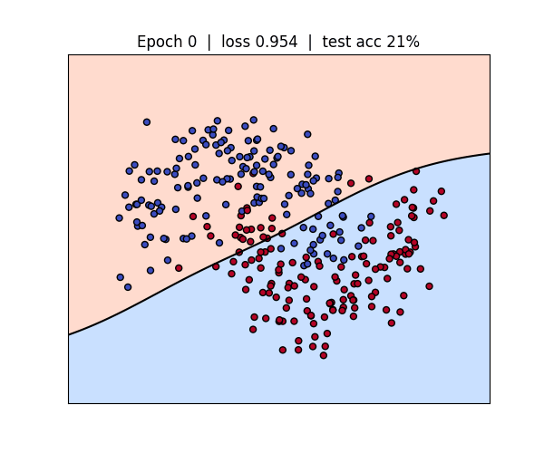
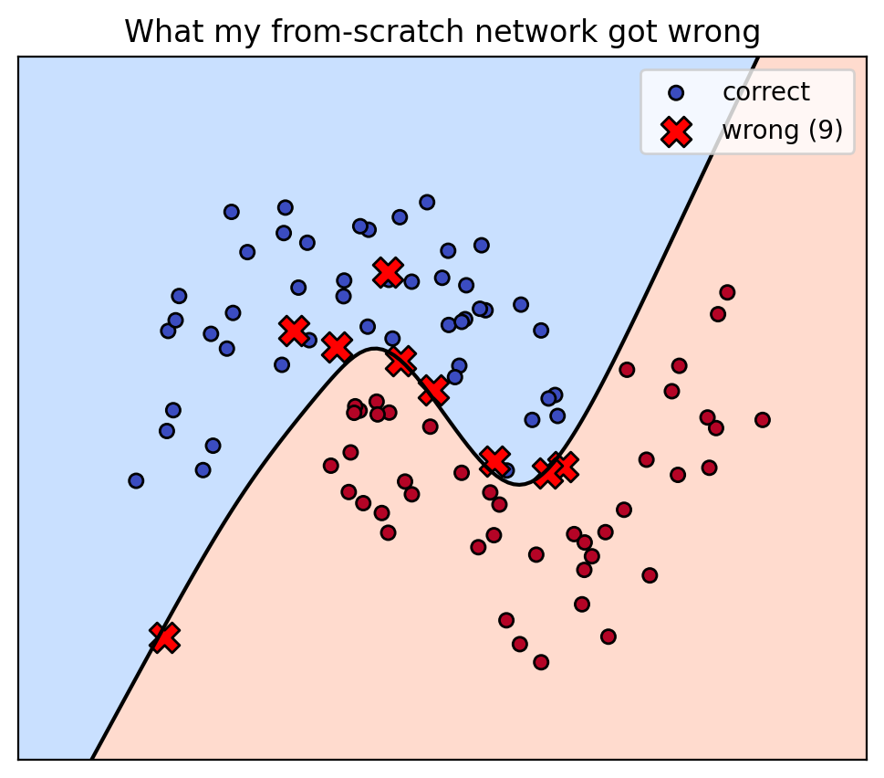

# 🧠 NeuroBoundary

**A neural network built from scratch in pure NumPy, watching its decision boundary learn in real time.**

[](https://colab.research.google.com/github/hadilhorchani/neuroboundary/blob/main/nn_decision_boundary.ipynb)


No TensorFlow. No PyTorch. Just matrices, gradients, and backpropagation written by hand.



## 🎯 What is this?

A small 2-16-1 neural network is trained on the classic **two moons** dataset. Every 25 epochs the code saves a snapshot of the decision boundary, then stitches the snapshots into an animation so you can *see* the model learn.

It then highlights the test points the network got wrong:



## 📊 Results

| Metric | Value |
|---|---|
| Dataset | `make_moons` (400 samples, noise 0.25) |
| Train / test split | 75% / 25% |
| Architecture | 2 → 16 (tanh) → 1 (sigmoid) |
| Final test accuracy | **91%** |
| Misclassified test points | **9 / 100** |

**Takeaway:** the errors cluster right on the boundary, where the two classes genuinely overlap. The network isn't failing randomly, the data is ambiguous in that region.

## ⚙️ How it works

**Forward pass**

```
A1 = tanh(X · W1 + b1)
A2 = sigmoid(A1 · W2 + b2)
```

**Loss:** binary cross-entropy

**Backward pass (backpropagation by hand)**

```
dZ2 = A2 - y
dW2 = A1ᵀ · dZ2 / m
dZ1 = (dZ2 · W2ᵀ) * (1 - A1²)      # tanh derivative
dW1 = Xᵀ · dZ1 / m
```

**Update:** plain full-batch gradient descent (learning rate 0.5, 1500 epochs).

## 🚀 Run it

**Option 1: in the browser (no install).** Click the **Open in Colab** badge above and run all cells.

**Option 2: locally**

```bash
git clone https://github.com/hadilhorchani/neuroboundary.git
cd neuroboundary
pip install -r requirements.txt
jupyter notebook nn_decision_boundary.ipynb
```

## 📁 Repository structure

```
neuroboundary/
├── nn_decision_boundary.ipynb   # the full notebook
├── decision_boundary.gif        # training animation
├── what_it_got_wrong.png        # misclassified test points
├── requirements.txt
└── README.md
```

## 🔭 Ideas to extend it

- [ ] Switch to the **spiral** dataset (needs a bigger network and more epochs)
- [ ] Compare against the same model in Keras or PyTorch
- [ ] Add a second hidden layer and watch how the boundary changes
- [ ] Try different activations (ReLU vs tanh) and learning rates
- [ ] Add L2 regularization or dropout and compare overfitting

## 👩‍💻 Author

**Hadil Horchani**, Master's student in Data Science & AI (ISSAT Gafsa).

[LinkedIn](https://www.linkedin.com/in/hadil-horchani-981b83317) · [GitHub](https://github.com/hadilhorchani)

⭐ If this helped you understand neural networks, a star on the repo means a lot!
